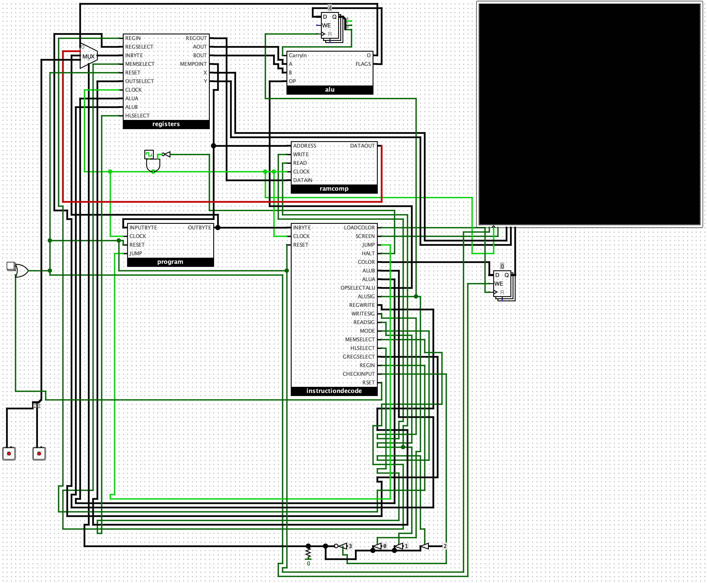
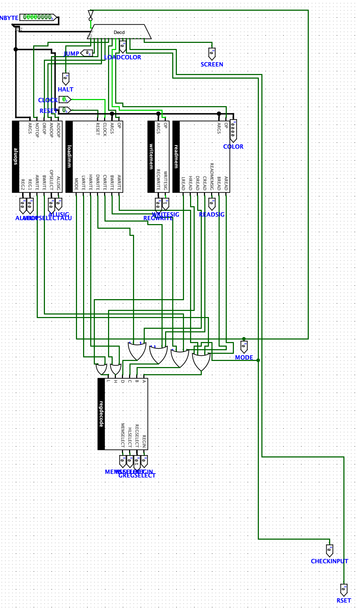

# An 8-Bit Minicomputer

This repository houses my 8-bit minicomputer design. It also contains a custom assembly language and assembler written in C.

## Computer Architecture

### Registers
The computer contains 4 general purpose registers (A, B, C, D), 2 8-bit memory pointing registers (H, L), a 3-bit flags register, a 4-bit color register, an instruction pointer register, and status registers for handling immediate values. The h and l registers are for low and high values of the memory pointer respectively. These h and l registers are used for indirect memory addressing.

### Memory
The computer contains a 16-bit address space for variables. This space is currently unorganized, but can be organized however the programmer wishes.

### Programs
Programs for the computer are loaded into ROM, which also has a 16-bit address width. This ROM is separate from the RAM where values can be stored during execution.

### Assembly Code
- If you want to write assembly code for this minicomputer, there are currently 12 recognized instructions divided by how many arguments they take. Function titles are preceeded by the word fcn.

0 Arguments:
- hlt: Halts all execution on the minicomputer.
- rst: Resets all register contents on the minicomputer, including status registers
- scn: Draws a single grayscale pixel to the 256 x 256 pixel screen. The X coordinate of the drawing is determined by the contents of register 

1 Argument:
- inp: Takes 8-bits from the single input port connected to the computer. Argument provided is the destination register for the input value.
- jmp: Jump to a given location in the program ROM. This takes a function title as an argument, which the assembler turns into a binary address.
- wrt: Writes a value from a register into memory. Address written to in memory is provided by contents of the h and l registers. Argument needed is the source register.
- ldc: Takes a 4-bit immediate value to be loaded into the color register.

2 Arguments:
- not: Performs a not operation on a byte, flipping all of the bits. 2 arguments provided are the source register and destination register.
- mov: Moves an 8-bit immediate value into a register. Arguments needed are register destination, including memory registers, and the byte to be written.
- ldm: Loads a value from memory into a register. Arguments provided are the destination register and the varianble name of the memory address.

3 Arguments:
- add: Performs an addition operation between two bytes. Arguments provided are the two source registers and the destination register.
- and: Performs an and operation between two bytes. Arguments provided are the two source registers and the destination register.
- oro: Performs an or operation between two bytes. Arguments provided are the two source registers and the destination register.

### Quirks of the Computer
- The only destination registers available are registers A and B
- Not can not be performed on the contents of register D
- When jumping, the memory address in H and L is used to provide the address to jump to